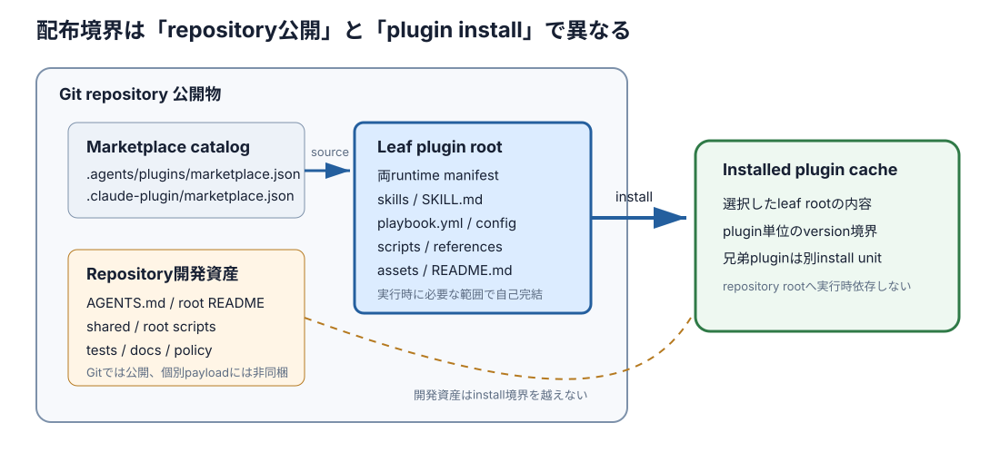

# Plugin 配布境界ガイドライン

> 型: コンセプトドキュメント ／ 読み手: この workspace 配下の marketplace repository を保守する人

> 一言でいうと——**plugin として配布する単位は、marketplace catalog の `source` が指す plugin root である。** Repository に置かれた全ファイルを、個別 plugin のインストール物とみなしてはならない。

- **[最重要]** **Git repository の公開範囲と、plugin のインストール範囲を分けて判断する。**
- **[ポイント]** **実行時に必要なものは plugin root 内で自己完結させる。** Repository root の `shared/` へ実行時依存を作らない。
- **[ポイント]** **配布対象は両 runtime の marketplace catalog と plugin manifest で一致させる。**

確認時点は 2026-09-02 である。対象は、この workspace 直下にある10の `*-plugins` marketplace repository である。構成比較は、関連するコード地図に記載した各 `main` HEADを固定参照点にする。

## 概要

**この repository 群の配布境界は、repository 公開物、marketplace catalog、plugin package の3層で定義する。** Git へ commit したファイルは repository の閲覧・clone 対象になる。個別 plugin のインストール物は、catalog が指す leaf directory の配下だけである。

**Marketplace catalog は plugin package の一覧と入口を定義する。** Codex は `.agents/plugins/marketplace.json` の `plugins[].source.path` を使う。Claude Code は `.claude-plugin/marketplace.json` の `plugins[].source` を使う。現在の43 entryでは、両者の plugin 名、version、source path が一致している。

**Plugin root はインストール後に単独で動ける配布単位である。** 多くは `plugins/skills/<領域>/<plugin>/` または `plugins/playbooks/<領域>/<plugin>/` にあり、領域を持たない `plugins/<plugin>/` もある。兄弟 plugin と repository root は、同じ repository にあっても自動では同梱されない。

*図1: Catalog は repository 内の leaf plugin root を選ぶ。Install cache へ渡る境界は、その root の内側で閉じる。*

| 境界 | 含むもの | 個別 plugin install への扱い |
|---|---|---|
| Repository 公開物 | tracked file、catalog、plugin source、開発用 script、test、資料 | Repository としては取得できるが、全体を1 plugin として扱わない |
| Marketplace catalog | plugin 名、version、source path、runtime 固有 metadata | Marketplace 登録と plugin 選択に使う。個別 plugin payload そのものではない |
| Plugin package | catalog の source が指す directory 配下 | 選択した plugin のインストール対象 |
| Runtime 生成物 | resolved config、state、収集物、生成資料、cache | Source packageへ commit・同梱しない |

### 現在配布している marketplace と plugin

**10 marketplace は合計43 entryを公開している。** `intermediate-cleanup` は2 marketplaceに別々の source rootを持つため、plugin名の種類として数えると42になる。依存解決と変更判断では、marketplace名とplugin名の組を使う。

| Marketplace repository | 件数 | Plugin |
|---|---:|---|
| [agent-fleet-plugins](https://github.com/nakamori-naoya/agent-fleet-plugins/blob/main/.agents/plugins/marketplace.json) | 3 | `agent-fleet-core`、`agent-fleet-herdr`、`agent-fleet-session-hooks` |
| [agent-roles-plugins](https://github.com/nakamori-naoya/agent-roles-plugins/blob/main/.agents/plugins/marketplace.json) | 1 | `agent-roles` |
| [agent-work-policy-plugins](https://github.com/nakamori-naoya/agent-work-policy-plugins/blob/main/.agents/plugins/marketplace.json) | 1 | `agent-work-policy` |
| [bdd-discovery-and-formulation-plugins](https://github.com/nakamori-naoya/bdd-discovery-and-formulation-plugins/blob/main/.agents/plugins/marketplace.json) | 12 | `domain-bdd-discovery`、`domain-bdd-formulation`、`data-model-bdd-discovery`、`data-model-bdd-formulation`、`user-journey-bdd-discovery`、`user-journey-bdd-formulation`、`domain-events`、`core-domain`、`user-journey`、`persistence-scenarios`、`data-model`、`rdb-design` |
| [collect-and-digest-plugins](https://github.com/nakamori-naoya/collect-and-digest-plugins/blob/main/.agents/plugins/marketplace.json) | 5 | `meeting-collect`、`session-collect`、`slack-collect`、`digest`、`session-digest` |
| [grill-plugins](https://github.com/nakamori-naoya/grill-plugins/blob/main/.agents/plugins/marketplace.json) | 1 | `grill` |
| [product-planning-plugins](https://github.com/nakamori-naoya/product-planning-plugins/blob/main/.agents/plugins/marketplace.json) | 7 | `product-context`、`product-north-star`、`product-strategy`、`strategy-critique`、`intermediate-cleanup`、`product-north-star-planning`、`product-strategy-planning` |
| [pull-request-plugins](https://github.com/nakamori-naoya/pull-request-plugins/blob/main/.agents/plugins/marketplace.json) | 8 | `pr-conflict-inspect`、`pr-conflict-resolve`、`pr-create`、`pull-request`、`pr-review-assess`、`pr-review-apply`、`pr-review-verify`、`pr-review-response` |
| [skill-authoring-plugins](https://github.com/nakamori-naoya/skill-authoring-plugins/blob/main/.agents/plugins/marketplace.json) | 1 | `skill-authoring` |
| [write-doc-plugins](https://github.com/nakamori-naoya/write-doc-plugins/blob/main/.agents/plugins/marketplace.json) | 5 | `write-doc`、`content-types`、`writing-rules`、`visual-guidance`、`doc-render` |

### Plugin root 内で配布するもの

**実行時に読むファイルは、用途に応じて plugin root 内へ置く。** すべての directory を空で揃える必要はない。manifest capability と plugin の責務に必要なものだけを置く。

| 置き場 | 責務 | 配布判断 |
|---|---|---|
| `.codex-plugin/plugin.json` | Codex 向け identity、version、capability、UI metadata | 必須 |
| `.claude-plugin/plugin.json` | Claude Code 向け identity、version、skill path | 必須 |
| `skills/` | Runtime が発見する skill entry | Skill を公開する plugin で配布 |
| `SKILL.md` | Plugin 固有手順の正本 | 単一入口の skill / playbook で配布。複数 skill や script-only は例外 |
| `playbook.yml` | 工程、依存、入出力、停止条件 | Playbook plugin で配布 |
| `scripts/` | 設定解決、検査、保存などの決定的処理 | 実行に必要な script を配布 |
| `references/` | 実行中に必要時だけ読む契約・方法論 | 参照する plugin で配布 |
| `config/defaults.yml` | 同梱既定と設定 schema の基準 | 静的設定を持つ plugin で配布 |
| `assets/` | Template、example、画像、render shell | 生成・描画に必要な plugin で配布 |
| `README.md` | 個別 plugin の利用法と設定 | Plugin 単体の説明として配布 |

### Plugin として配布しないもの

**Repository root の開発資産は、個別 plugin packageへ混入させない。** ただしGit repositoryの公開物ではあるため、「非公開」ではなく「plugin installの対象外」と表現する。

| Repository root の置き場 | 責務 | Plugin install への扱い |
|---|---|---|
| `README.md` | Marketplace 全体の説明と導入 | 対象外。Plugin 内 `README.md` とは別物 |
| `AGENTS.md` | Source repository を変更する agent 向け規範 | 対象外 |
| `.harness-plugins/` | この source repository 自身の作業方針 | 対象外。利用先 repository の設定は利用先が所有する |
| `scripts/` | Repository 全体の validation 入口 | 対象外。Plugin root 内 `scripts/` とは別物 |
| `shared/` | 複数 plugin へ複製する共通 source の正本 | 直接は対象外。必要な copy を plugin root へ置く |
| `tests/` | Repository-level test | 対象外 |
| `docs/`、`VALIDATION.md` | Marketplace 全体の作例・検証説明 | 対象外 |
| `.gitignore`、`.git/` | Source 管理規則と Git metadata | 対象外。`.git/` は commit 対象でもない |

### 公開Git操作の所有境界

**PRを扱うpluginと公開Git操作を実行するpluginの責務は分ける。** pull-request pluginはPRの準備・本文・review手順を所有できるが、commit、push、PR作成、mergeを許す判断や実行は`agent-work-policy`の`prepare.sh`と`control.py`へ委譲する。permission、human gate、commit前検証、PR readinessを一つの正本に置くことで、各pluginが異なる公開規則を複製しない。

この契約はplugin install payload内の`SKILL.md`、`references/operation-contract.md`、`scripts/control.py`で完結する。repository rootの`tests/`はその公開APIをBDD fixtureで検査する開発資産であり、install payloadへ混入させない。

### 新規追加・変更時の判断規則

**配置は「誰が、いつ読むか」で決める。** Plugin install 後の実行に必要なら plugin root、repository の開発・release にだけ必要なら repository rootへ置く。

1. Plugin の責務と marketplace を決める。
2. `plugins/skills/<領域>/<plugin>/` または `plugins/playbooks/<領域>/<plugin>/` に leaf root を作る。
3. Codex と Claude Code の catalogへ同じ plugin名、version、source pathを登録する。
4. Plugin root の両 manifestへ同じ identity と versionを書く。
5. 実行時に必要な script・reference・asset・bundled defaultを plugin root 内へ置く。
6. 外部 plugin はコピーせず、完全修飾した依存として宣言する。
7. Repository-level validationへ、catalog集合、source path、manifest、shared copy、構文の検査を追加する。
8. 実インストール後の payload に repository root の開発資産が混入しないことを検査する。

## なぜこうなっているか

**Plugin ごとに leaf root を閉じるのは、インストール時に repository root が実行環境へ届かないためである。** [共通 resolver](https://github.com/nakamori-naoya/write-doc-plugins/blob/main/shared/skill/resolve.sh) は次の制約を明記している。

> インストールで運ばれるのは配布物のディレクトリだけなので、リポジトリ root の共有ファイルは配布先へ届かない。

**この制約に従い、`shared/` の必要部分は各 plugin root へ複製する。** Repository validation は `cmp` などで正本と copy の一致を検査する。Plugin の実行時コードから repository root の `shared/` を相対参照してはならない。

**Runtime ごとの catalog と manifest を並置するのは、同じ plugin を異なる schema へ適合させるためである。** ファイルは統合せず、identity、version、source集合の一致を機械検査する。Runtime 固有の policy や interface は、それぞれの manifest に残す。

**外部依存を物理的に同梱しないことで、plugin の所有境界を維持する。** Playbook は依存先を marketplace名、plugin名、repository方針に応じたversionで解決する。`requires` に書かれた依存は、入口 plugin root の一部ではない。

## 採らなかった選択肢

| 選択肢 | なぜ採らなかったか |
|---|---|
| Repository 全体を1つの plugin として扱う | 現在の catalog は43個の leaf rootを別々の install unitとして定義している |
| Repository root の `shared/` を実行時に直接読む | Install先へ repository root が届かず、plugin 単体で動かない |
| 外部依存 plugin を入口 plugin へコピーする | Marketplace と plugin の所有境界が崩れ、versionと正本が複数になる |
| Runtime 別 manifest を1ファイルへ統合する | Codex と Claude Code で必要な schema と metadata が異なる |

## 関連コンセプト

- [Plugin repository のコード地図](plugin-repository-directory-structure.md) — Repository root と plugin root の置き場、責務、構成差を確認する。
- [Write Doc marketplace README](https://github.com/nakamori-naoya/write-doc-plugins/blob/main/README.md) — Marketplace 登録、plugin install、設定優先順位の実例を確認する。
- [BDD marketplace の配布境界検査](https://github.com/nakamori-naoya/bdd-discovery-and-formulation-plugins/blob/main/scripts/validate-structure.sh) — Plugin集合と責務境界を検査する実例を確認する。

## その他の情報

**固定参照点では、10 repository の `scripts/validate.sh` がすべて成功した。** 現行検査は marketplace 集合、manifest identity、構文、repositoryごとの追加契約を確認している。

**成功は、実インストール payload と repository 間の完全な構成一致までは保証しない。** Source path の安全性、余剰 directory、root開発物の非混入、全 shared copy の同期は、repositoryにより検査範囲が異なる。統一候補と現状差は、関連するコード地図の「アーキテクチャ上の特徴」にまとめる。
