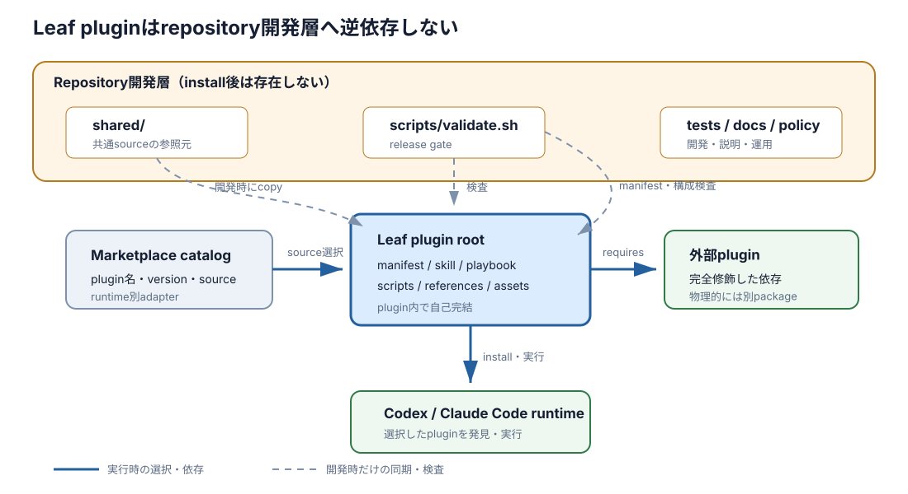

# Plugin repository 群のコード地図

> 型: コード地図（マクロ） ／ 読み手: この workspace の plugin を追加・変更・レビューする人 ／ 対象: 7つの `*-plugins` repository

- **固定した参照点**: 2026-08-27 時点の各 `main` HEAD。下表に commit を示す。
- **扱う範囲**: Repository root、marketplace catalog、plugin root の配置と責務、7 repository 間の構成差。個別 plugin の処理順と業務内容は扱わない。

> 一言でいうと——**7 repository は共通の配布骨格を持つが、構成は完全には同一でない。** 妥当な機能差と構成ドリフトを分けて管理する。

| Repository | Commit | 配布 plugin 数 |
|---|---|---:|
| `agent-work-policy-plugins` | `d0ae30dd0c4d` | 1 |
| `bdd-discovery-and-formulation-plugins` | `b1f00b266f0a` | 10 |
| `collect-and-digest-plugins` | `cfec46b843b9` | 5 |
| `grill-plugins` | `965f13d91b95` | 1 |
| `product-planning-plugins` | `f41790975483` | 7 |
| `pull-request-plugins` | `203b752cccf5` | 8 |
| `write-doc-plugins` | `16c26afb594c` | 5 |

## ① 何をするシステムか

**各 repository は、Claude Code と Codex の双方へ1個以上の plugin を公開する marketplace source である。** Marketplace catalog は配布する plugin と source root を列挙する。各 leaf plugin root は、skill、playbook、script-onlyのいずれかとして実行時責務を持つ。

## ② 地図

**最初に見るべき境界は、repository root と leaf plugin root である。** 中間の `skills` / `playbooks` と領域 directory は分類であり、配布単位ではない。

```text
<marketplace>-plugins/
├── .agents/plugins/marketplace.json     # Codex marketplace catalog
├── .claude-plugin/marketplace.json      # Claude Code marketplace catalog
├── .harness-plugins/                    # このsource repoの作業設定
├── AGENTS.md                            # 変更時の責務・禁止事項
├── README.md                            # marketplace全体の入口
├── plugins/
│   ├── skills/<領域>/<plugin>/          # leaf skill plugin root
│   └── playbooks/<領域>/<plugin>/       # leaf playbook plugin root
├── shared/                              # pluginへ複製する開発時正本
├── scripts/validate.sh                  # repository-level検証入口
├── tests/                               # 任意の追加scenario test
└── docs/                                # 任意のmarketplace全体資料
```

### Repository root の責務

| 置き場 | 責務 | Plugin install 対象 | 最初に開くなら |
|---|---|---|---|
| `.agents/plugins/` | Codex catalog | 個別payloadではない | `marketplace.json` |
| `.claude-plugin/` | Claude Code catalog | 個別payloadではない | `marketplace.json` |
| `plugins/` | 全leaf plugin rootを領域別に収容 | Catalogが指すleafだけ対象 | 対象pluginの両manifest |
| `shared/` | 複数pluginへ同期する共通sourceの正本 | 直接は対象外 | `prepare.sh`、`skill/resolve.sh`、`playbook/resolve.sh` |
| `scripts/` | Repository全体の整合性と構文を検査 | 対象外 | `validate.sh` |
| `.harness-plugins/` | Source repositoryのagent作業方針 | 対象外 | `agent-work-policy.config.yml` |
| `AGENTS.md` | Repository責務、禁止事項、検証command | 対象外 | `AGENTS.md` |
| `README.md` | Marketplaceの目的、導入、依存、設定 | 対象外 | `README.md` |
| `tests/`、`docs/` | 追加test、作例、演習 | 対象外 | Repository固有の入口 |

### Leaf plugin root の責務

| 置き場 | 責務 | 同梱条件 | 最初に開くなら |
|---|---|---|---|
| `.codex-plugin/`、`.claude-plugin/` | Runtime別 identity、version、capability | 全plugin | `plugin.json` |
| `skills/` | Runtimeへ公開する skill entry | Skillを公開するplugin | `<skill>/SKILL.md` |
| `SKILL.md` | Plugin固有手順の正本 | 単一入口型で使用 | `SKILL.md` |
| `playbook.yml` | 工程、依存、needs/provides、契約 | Playbookのみ | `playbook.yml` |
| `config/` | Bundled defaultと静的schema | 設定を持つplugin | `defaults.yml` |
| `scripts/` | Prepare、resolve、検査、保存、domain処理 | 必要なplugin | `prepare.sh` または主処理 |
| `references/` | 詳細規律、schema、契約、方法論 | 必要なplugin | `SKILL.md` が直接指す文書 |
| `assets/` | Template、example、画像、render shell | 必要なplugin | `SKILL.md` または設定が指すasset |
| `README.md` | Plugin単体の人向け説明 | 全plugin | `README.md` |

### Plugin の3構成

**Plugin root の必須要素は capability に応じて変わる。** 空 directory で見た目を揃えず、次のvariantを規約として揃える。

| Variant | 中心要素 | 現在の例 | 意図的な例外 |
|---|---|---|---|
| 単一 skill | Root `SKILL.md` と薄い `skills/<name>/SKILL.md` | `grill`、`content-types` | 設定・reference・assetは必要な場合だけ |
| 複数 skill playbook | `playbook.yml` と複数の `skills/*/SKILL.md` | `digest` | Root `SKILL.md` が無い場合がある |
| Script-only | Manifest の `Scripts` capability と `scripts/` | `doc-render` | Root / nested `SKILL.md` が無い |

## ③ 層と依存の向き

**依存は catalog から leaf plugin rootへ向かい、leaf plugin rootは同梱copyまたは明示した外部pluginだけへ依存する。** Plugin runtime から repository root の開発資産へ逆流させない。



*図1: 実線は選択・同梱・実行時依存を示す。破線は開発時の同期と検証を示し、install後には残らない。*

| 依存元 | 許可する依存先 | 禁止する逆流 |
|---|---|---|
| Marketplace catalog | Catalogに列挙したleaf plugin root | Source pathでrepository外や親directoryを指さない |
| Leaf plugin root | Root内のscript・reference・asset・bundled config | Repository rootの`shared/`、`tests/`、`docs/`を実行時に直接読まない |
| Playbook | 完全修飾した外部plugin | 外部pluginのsourceを入口rootへコピーしない |
| Repository validation | Catalog、全manifest、shared正本とcopy | Validation script自体をplugin runtimeから呼ばない |

## ④ 重要な入口

**用途ごとの入口を5つに限定する。** 個別処理を追う場合は、対象pluginの `SKILL.md` または主scriptへ進む。

| 入口 | 何が始まるか | 実行順を追うなら |
|---|---|---|
| `.agents/plugins/marketplace.json` | Codexの配布plugin選択 | Entryの`source.path`が指すrootへ進む |
| `.claude-plugin/marketplace.json` | Claude Codeの配布plugin選択 | Entryの`source`が指すrootへ進む |
| `plugins/**/.codex-plugin/plugin.json` | Plugin identityとcapabilityの確認 | `skills`または`Scripts`の指定先へ進む |
| Plugin rootの`SKILL.md` / `playbook.yml` | 単一手順または工程契約の確認 | `scripts/prepare.sh`、各stepへ進む |
| `scripts/validate.sh` | Repository-levelのrelease gate | 呼び出す追加validatorやtestへ進む |

## ⑤ アーキテクチャ上の特徴

**共通配布骨格は揃っているが、構成と検証方針には統一候補が残る。** 37 source pathはすべて `plugins/{skills|playbooks}/{領域}/{plugin}` の同じ深さにある。両runtimeのcatalogと両manifestも現在は一致し、7 repositoryのvalidationはすべて成功した。

### 一貫性の評価

| 観点 | 現状 | 判定 | 推奨 |
|---|---|---|---|
| Rootの必須骨格 | 7/7に`.agents`、`.claude-plugin`、`.harness-plugins`、`plugins`、`shared`、`scripts`、`AGENTS.md`、`README.md`がある | 一貫 | 必須骨格として維持する |
| Plugin source path | 37/37が同じ4段構成 | 一貫 | `plugins/{skills|playbooks}/{領域}/{plugin}` に固定する |
| Runtime間のidentity | 全37 entryでname、version、sourceが一致 | 一貫 | 全repositoryで同じvalidatorへ統一する |
| Plugin rootの共通要素 | 37/37に両manifest、`README.md`、`scripts/`がある。`skills/`は36/37、root `SKILL.md`は35/37 | 一貫 | `doc-render`と`digest`のcapability由来の例外を規約へ固定する |
| Symlink | Plugin source内に存在しない | 一貫 | Source境界を曖昧にするsymlinkを禁止する |
| `.gitignore` | BDD、grill、write-docの3/7だけに存在 | 不一致 | 共通templateを7/7へ置くか、不要理由を規約化する |
| 追加testの置き場 | BDDは`scripts/validate-*.sh`、productは`tests/` | 不一致 | `scripts/validate.sh`を公開入口に保ち、詳細scenarioを`tests/`へ寄せる |
| Playbook依存version | 5つのplaybook repositoryがmarketplace名とplugin名で解決し、versionを固定しない | 一貫 | 解決先のidentityと必要skillを全repositoryで検査する |
| Product→grill依存 | Productはversionを固定せず、`grill@grill`を名前で解決する | 一貫 | Workspace横断testでlatest compatible versionを継続検査する |
| `intermediate-cleanup` | BDDとproductの2 marketplaceに別sourceとして重複 | 要確認 | 完全修飾名で扱い、同一正本に寄せるか別物としてversion管理する |
| 余剰directory | BDDの`plugins/playbooks/authoring/`が空 | ドリフト | 削除するか、将来用途を文書化する |
| Shared copyの同期検査 | Repositoryにより検査対象が異なる | 不一致 | `prepare.sh`、skill resolver、playbook resolverを共通検査する |
| Configless pluginの`prepare.sh` | `--root-only`では正常だが、汎用usageが示す通常実行は`resolve.sh`欠落で失敗する | 契約不一致 | Root-only専用入口を分けるか、usageと実装を一致させる |
| Install payload検査 | どのrepositoryも実install後payloadをrelease gateで比較しない | 保証不足 | Fixture installでroot開発物の非混入とpayload完全性を検査する |

**空 directory や optional asset の有無は同じ種類の差ではない。** Capability が違うために `config/`、`references/`、`assets/`、root `SKILL.md` が無いことは妥当である。空の余剰分類directory、同じ責務のtest配置、dependency policyの差は構成ドリフトとして扱う。

### Repository ごとの差

| Repository | 共通骨格からの主な追加・差異 | 評価 |
|---|---|---|
| `agent-work-policy-plugins` | 単一skill。`shared/skill/`を持つ | 妥当 |
| `bdd-discovery-and-formulation-plugins` | 10 plugin、専門知識の`shared/*`、`VALIDATION.md`、分割validator、空の`plugins/playbooks/authoring/` | 専門sharedと詳細検証は妥当。空directoryは整理候補 |
| `collect-and-digest-plugins` | 3 skillと2 playbook。`digest`は複数skillを1 rootに収容 | 妥当 |
| `grill-plugins` | 単一skill。題材固有の観点を持たない | 妥当 |
| `product-planning-plugins` | `docs/exercises/`、`tests/`、`shared/product/` | 作例とscenario testとして妥当。依存versionは要確認 |
| `pull-request-plugins` | Skillは個別prepare中心で、`shared/skill/`を持たない | 機能差として妥当。共通化要否は要確認 |
| `write-doc-plugins` | `shared/playbook/state.py`、script-onlyの`doc-render` | Playbook状態管理とcapability差として妥当 |

### 機械検査の限界

**現行validationが成功しても、構成一貫性のすべては証明されない。** 多くのvalidatorはCodex catalogをexpected集合として使い、Claude catalogのplugin名集合とmanifest identityを照合する。一方、Claude側source pathの完全一致、source pathの`..`禁止、manifestを持たない余剰directory、実install後payloadは共通には検査しない。

**共通validatorを1つの正本にし、各repositoryの`validate.sh`から呼ぶ構成が望ましい。** 共通検査はroot骨格、両catalogの全field、source path安全性、両manifest、実行権限、shared同期、余剰leaf、install payloadを対象にする。Repository固有の責務境界とBDD scenarioは、その後段で追加する。

## ⑥ 次に読むもの

- 配布対象を判断する: [Plugin 配布境界ガイドライン](plugin-distribution-guidelines.md)
- Marketplace一覧と導入を確認する: 各repositoryの `README.md`
- 個別pluginの手順を追う: Catalogのsource rootにある `SKILL.md`、`playbook.yml`、`scripts/prepare.sh`
- 現行のrelease gateを確認する: 各repositoryの `scripts/validate.sh`
- 構成統一を実装する場合: 共通validatorのdesign docを別途作り、既存差異の移行順を合意する
